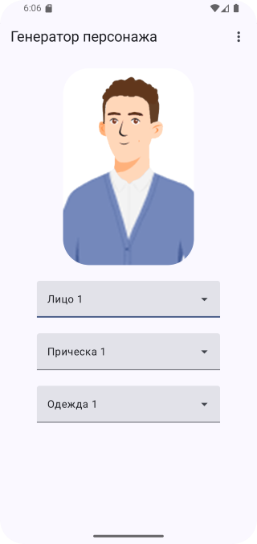
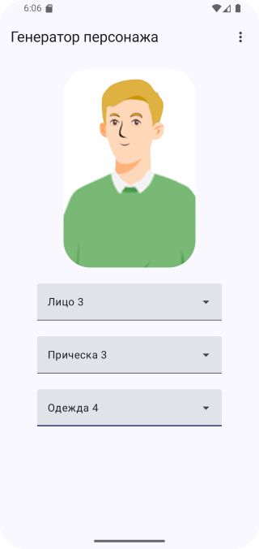
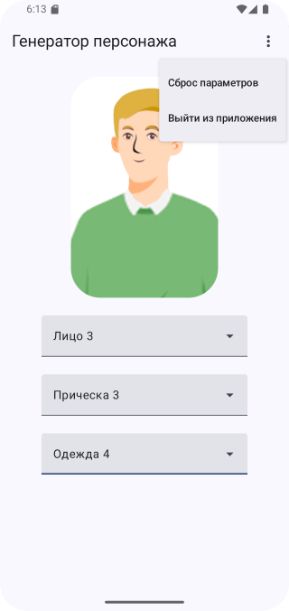

# Домашнее задание по теме "Image"

## Приложение "Конструктор персонажа"

На основе пройденного материала необходимо написать приложение «Конструктор персонажа».
Суть приложения заключается в том, что пользователь, выбирая различные параметры с помощью компонентов `ExposedDropdownMenu` такие как: цвет волос, прическа, борода/усы, аксессуары, может собрать своего персонажа, который будет отображен на экране в компоненте `Image`. Пользователь так же может сбросить все изменения до начального состояния или сформировать случайный образ выбрав соответствующую опцию в отдельном `DropdownMenu`.

## Скриншоты домашего задания по теме "Image"

